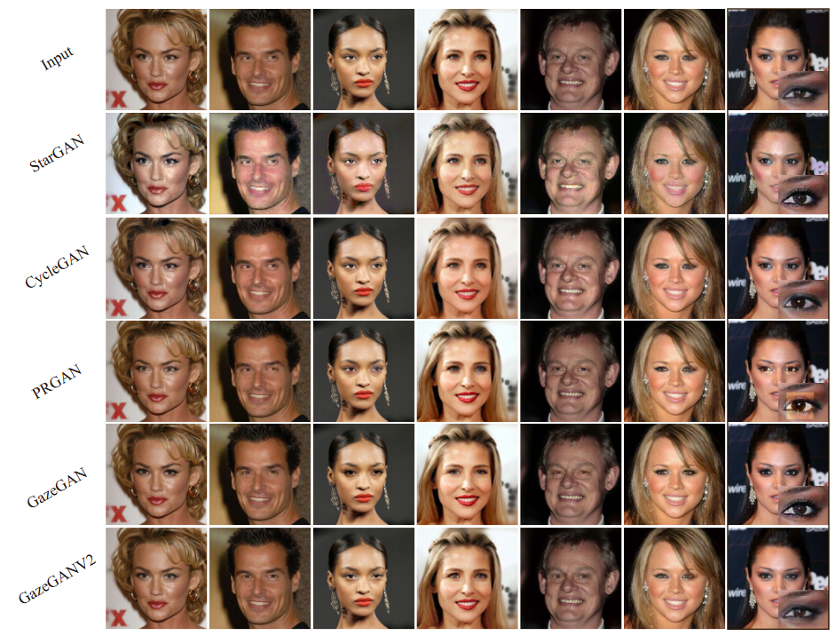

## GazeAnimationV2 - Official Tensorflow Implementation

> ***Unsupervised High-Resolution Portrait Gaze Correction and Animation***<br>
> Jichao Zhang, Jingjing Chen, [Hao Tang](https://ha0tang.github.io/), [Enver Sangineto](https://disi.unitn.it/~enver.sangineto/index.html), Yan Yan, Peng Wu, [Nicu Sebe](http://disi.unitn.it/~sebe/), [Wei Wang](https://weiwangtrento.github.io/).

## Dependencies

```bash
Python=3.6
pip install -r requirements.txt

```
Or Using Conda

```bash
-conda create -name GazeA python=3.6
-conda install tensorflow-gpu=1.9 or higher
```
Other packages installed by pip.

## Usage

- Clone this repo:
```bash
git clone https://github.com/zhangqianhui/GazeAnimation.git
cd GazeAnimation
git checkout GazeAnimationV2
```


- Download the CelebAGaze dataset

  Download the tar of CelebGaze dataset from [Google Driver Linking](https://drive.google.com/file/d/1_6f3wT72mQpu5S2K_iTkfkiXeeBcD3wn/view?usp=sharing).
  
  ```bash
  cd your_path
  tar -xvf CelebAGaze.tar
  ```
  
- Download the CelebHQGaze dataset

Download the tar of CelebHQGaze dataset from [Google Driver Linking](https://drive.google.com/file/d/1Q7iOc3ZWnyld2fbw6yYR0EIkF0m0FERN/view?usp=sharing).

```bash
cd your_path
tar -xvf CelebHQGaze.tar
```


## Experiment Result 

### Gaze Correction on CelebHQGaze

<p align="center"></p>

# Related works

- [Sparsely Grouped Multi-task Generative Adversarial Networks for Facial Attribute Manipulation](https://github.com/zhangqianhui/Sparsely-Grouped-GAN)

- [GazeCorrection:Self-Guided Eye Manipulation in the wild using Self-Supervised Generative Adversarial Networks](https://github.com/zhangqianhui/GazeCorrection)

- [PA-GAN: Progressive Attention Generative Adversarial Network for Facial Attribute Editing](https://github.com/LynnHo/PA-GAN-Tensorflow)
