# GazeCorrection: Self-Guided Eye Manipulation in the wild using Generative Adversarial Networks
The code of paper "GazeCorrection: Self-Guided Eye Manipulation in the wild using Generative Adversarial Networks". Paper will published coming soon.

--------------------------------------------

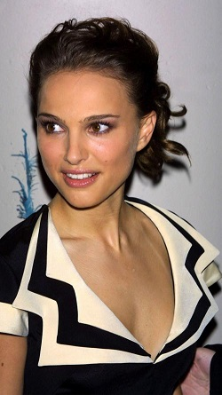
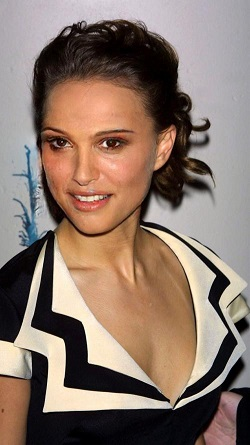

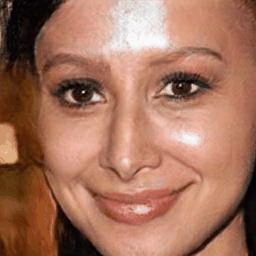

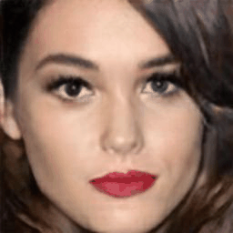

# Introduction

Gaze correction aims to redirect person's gaze into the camera by manipulating the eye region and it can be considered 
as a specific image resynthesis problems. Gaze correction has a wide range of applications in real life, for example the eye contract of
remote users in video conference systems. We proposed a simple but effective model which does not require the training dataset labelling with 
the head pose and eye angle information, even the majority training data not have the corresponding groundtruth between the different domains. Our proposed model is based on the generative adversarial networks
 and leverage encode-decode to learn the mapping from
the input facial image without the eye region to the facial image with corrected eye region.
Moreover, we propose a self-guided method to preserve the identity information of the in-painted images.
A new dataset has been collected for training and will be introduced in details.

## Network Architecture

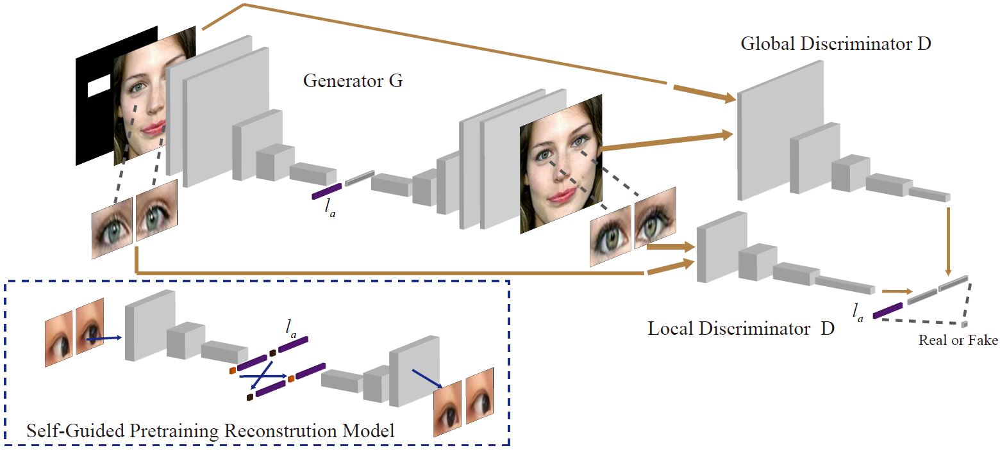


## 

## Dependencies
* [Python 2.7](https://www.python.org/download/releases/2.7/)
* [Tensorflow 1.4+](https://github.com/tensorflow/tensorflow)


## Usage

- Clone this repo:
```bash
git clone https://github.com/zhangqianhui/Eye_Rotation_GAN.git
```
- Download the Eye_Rotation dataset

Coming soon!!!

- Train the model using the default parameter
```bash
python main.py 
```


# The process of Experiments

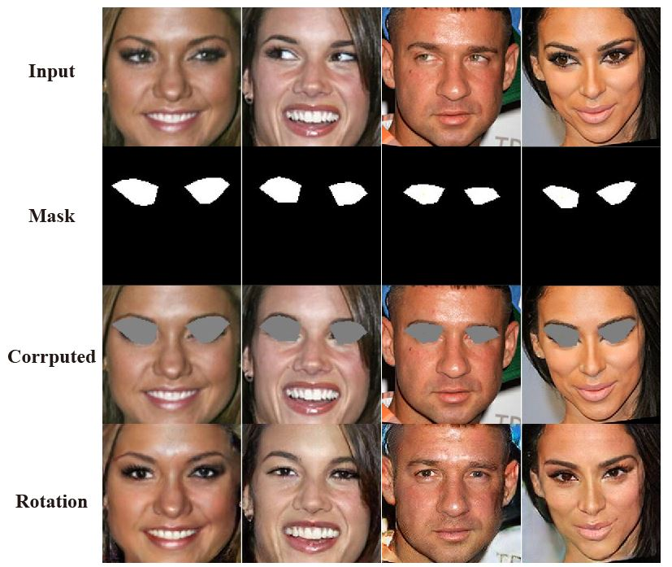

# More Results

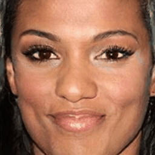
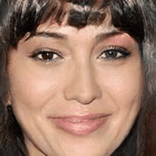
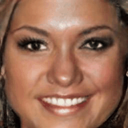


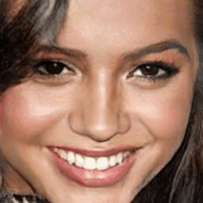
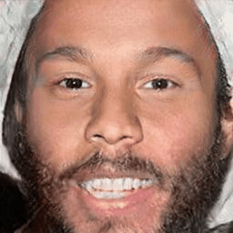
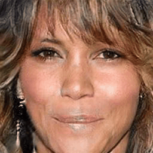
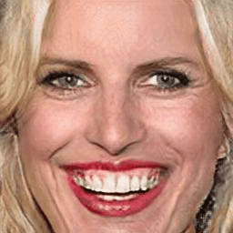
            
# Reference code

- [Sparsely_Grouped_GAN](https://github.com/zhangqianhui/Sparsely-Grouped-GAN)

- [DCGAN tensorflow](https://github.com/carpedm20/DCGAN-tensorflow)

- [Spectral Norm tensorflow](https://github.com/taki0112/Spectral_Normalization-Tensorflow)

- [Exemplar-GAN-Eye-Inpainting-Tensorflow](https://github.com/zhangqianhui/Exemplar-GAN-Eye-Inpainting-Tensorflow.git)

- [ELEGANT](https://github.com/Prinsphield/ELEGANT)
