# GazeCorrection:Self-Guided Eye Manipulation in the wild using Self-Supervised Generative Adversarial Networks
# V2 version can be found in [GazeAnimation](https://github.com/zhangqianhui/GazeAnimation)
Official code of paper [GazeCorrection:Self-Guided Eye Manipulation in the wild using Self-Supervised Generative Adversarial Networks](https://arxiv.org/abs/1906.00805). 

<p align="center">
  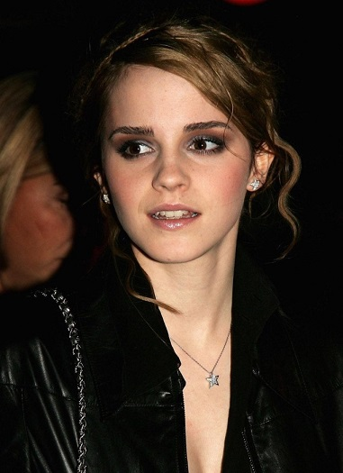
  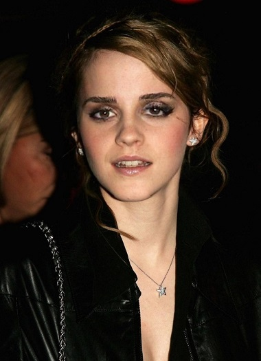
</p>


--------------------------------------------

[Paper](https://arxiv.org/abs/1906.00805) 

# Abstract
Gaze correction aims to redirect the person's gaze into the camera by manipulating the eye region, and
it can be considered as a specific image resynthesis problem. Gaze correction has a wide
range of applications in real life, such as taking a picture with staring at the camera.
In this paper, we propose a novel method that is based on the inpainting model to learn from
the face image to fill in the missing eye regions with new contents representing corrected eye gaze.
Moreover, our model does not require the training dataset labeled with
the specific head pose and eye angle information, thus, the training data is easy to collect.
To retain the identity information of the eye region in the original input,
we propose a self-guided pretrained model to learn the angle-invariance feature.
Experiments show our model achieves very compelling gaze-corrected results in the wild dataset which is collected
from the website and will be introduced in details. 

## Citation
If you find this work useful for your research, please cite our paper:
```
@article{zhang2019gazecorrection,
  title={GazeCorrection: Self-Guided Eye Manipulation in the wild using Self-Supervised Generative Adversarial Networks},
  author={Zhang, Jichao and Sun, Meng and Chen, Jingjing and Tang, Hao and Yan, Yan and Qin, Xueying and Sebe, Nicu},
  journal={arXiv preprint arXiv:1906.00805},
  year={2019}
}
```

## Network Architecture

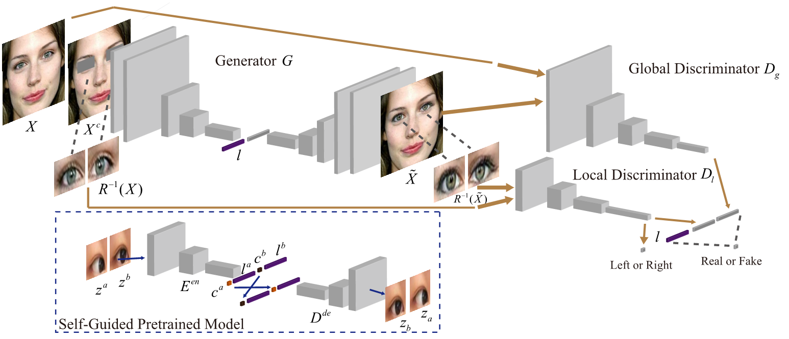


## 

## Dependencies

* [Python 3.6](https://www.python.org/download/releases/2.7/)
* [Tensorflow 1.9+](https://github.com/tensorflow/tensorflow)

```bash
pip install -r requirements.txt
```


## Usage

- Clone this repo:
  ```bash
  git clone https://github.com/zhangqianhui/GazeCorrection.git
  ```
- Download the NewGaze dataset

  Download the tar of NewGaze dataset from [Google Driver Linking](https://drive.google.com/open?id=1lYzpKdShN68RJGxRF1JgXnW-ved0F-mJ).
  
  ```bash
  cd your_path
  unzip NewGazeData.tar
  ```
  
  Please edit the options.py to change your dataset path

- Pretrained Self-Guided Model

  We have provided the self-guided pretraining model in directory: ./sg_pre_model_g

- Train this model 

  (1)Please edit the config.py file to select the proper hyper-parameters.
  
  (2)Change the "base_path" to "your_path" of NewGaze dataset.
  
  Then
  
  ```bash
  python train.py --use_sp --is_ss --gpu_id='0' --exper_name='log3_25_1' --batch_size=8 --test_sample_dir='test_sample_dir'
  ```
  
  or 
    
  ```bash
  bash scripts/train_log20_3_25_1.sh
  ```
  
- Test this model 
  
  You can download the pretrained model from [Google Driver Linking](https://drive.google.com/file/d/1Gt0tRGmEKwxyC8UVDrVT2qUnWgt2f6LF/view?usp=sharing).
  
   
  ```bash
  python test.py --gpu_id='0' --exper_name='log3_25_1' --batch_size=8 --test_sample_dir='test_sample_dir'
  ```
  
  or 
    
  ```bash
  bash scripts/test_log20_3_25_1.sh
  ```
  
## Experiments

- Comparison Results 

 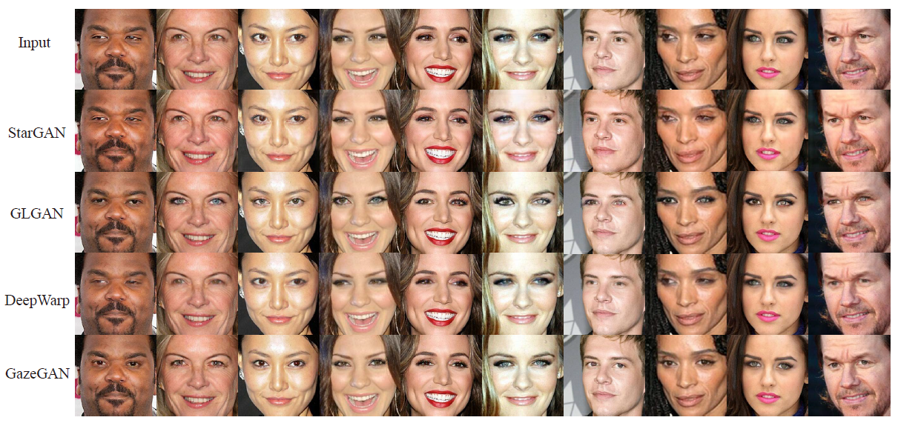
 
- Experiments Results 

 

# More results(GiF)

<p align="center">
  
  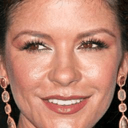
  
  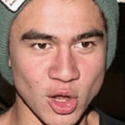
  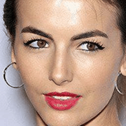
  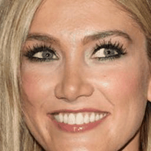
  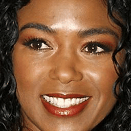
  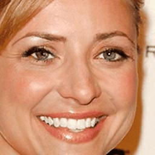
  
  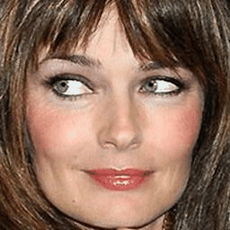
  
  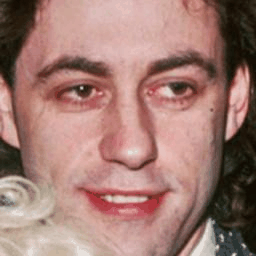
  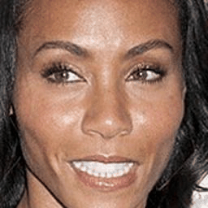
  
  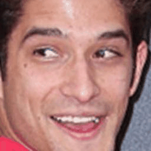
</p>


# Reference code

- [Sparsely Grouped Multi-task Generative Adversarial Networks for Facial Attribute Manipulation](https://github.com/zhangqianhui/Sparsely-Grouped-GAN)

- [DCGAN tensorflow](https://github.com/carpedm20/DCGAN-tensorflow)

- [Exemplar-GAN-Eye-Inpainting-Tensorflow](https://github.com/zhangqianhui/Exemplar-GAN-Eye-Inpainting-Tensorflow.git)
